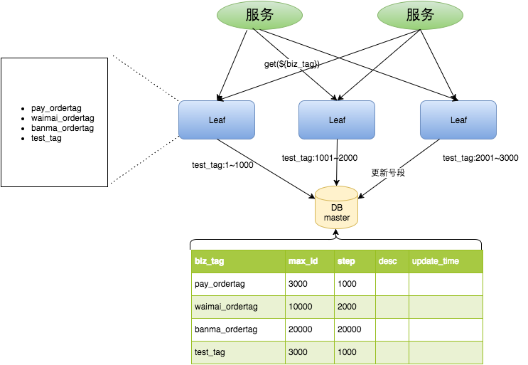

### 介绍
　　美团的 Leaf 框架有两种 ID 生成模式：号段模式、snowflake 模式。

### 号段模式
　　低位趋势增长，高可用，采用从数据库获取发号的起始 ID 值、最大 ID 值，发号是在本机进行，即使数据库宕机，也能保证一段时间内正常发号，ID 可计算，不适用于订单 ID 生成场景。



### snowflake 模式
　　完全分布式，ID 不可计算，可适用于订单 ID 生成场景。


```python

```
