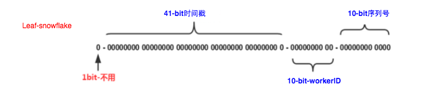

### ID 设计
　　以划分命名空间来生成 ID 的一种算法，即把 64 位的 ID 划分成多段，如下分别表示时间戳（41 位）、workerId（10 位）、序列号（12 位），位数可自行调整：



- 第一位为 0；
- 第 2- 42 位为相对时间戳，即用当前时间戳减去一个固定的历史时间戳生成；
- 第 43-52 位为机器号 workerId，每个机器的 ID 不同；
- 第 53-64 位为自增 ID。

#### 优点

- 毫秒数在高位，自增序列在低位，整个 ID 都是趋势递增的；
- 不依赖数据库第三方系统，以服务方式部署，即本机可自行生成 ID，稳定性高；
- 可根据自身业务特性分配 bit 位，比如将机器位的 10-bit 分 5-bit 给 IDC，分 5-bit 给机器，这样就可以表示 32 个IDC，每个 IDC 下可以有 32 台机器。

#### 缺点

- 强依赖机器时钟，如果机器上时钟回拨，会导致发号重复或者服务会处于不可用状态。比如今天 10:05 分发过一次号，如果时间又倒回 10:05 分，则发的号会重复。

### SnowflakeService
　　Leaf-snowflake 服务启动：

- 解析配置文件，获取 zookeeper 地址和 snowflake 端口号；
- 根据 zookeeper 地址和 snowflake 端口调用 SnowflakeIDGenImpl 启动 snowflake 服务；

```java
    public SnowflakeService() throws InitException {
        Properties properties = PropertyFactory.getProperties();
        // 解析参数 leaf.snowflake.enable，是否开启字典序排数算法
        boolean flag = Boolean.parseBoolean(properties.getProperty(Constants.LEAF_SNOWFLAKE_ENABLE, "true"));

        if (flag) {
            // 解析参数，获取 zookeeper 地址，比如 "192.168.1.159:2100,192.168.1.159:2101,192.168.1.159:2102"
            String zkAddress = properties.getProperty(Constants.LEAF_SNOWFLAKE_ZK_ADDRESS);
            // 解析参数，获取 snowflake 端口
            int port = Integer.parseInt(properties.getProperty(Constants.LEAF_SNOWFLAKE_PORT));
            // 根据 zookeeper 地址和 snowflake 端口生成
            idGen = new SnowflakeIDGenImpl(zkAddress, port);
            // snowflake 初始化成功
            if(idGen.init()) {
                logger.info("Snowflake Service Init Successfully");
            } else {
                throw new InitException("Snowflake Service Init Fail");
            }
        } else {
            // 不开启 snowflake 算法，则返回 ID 为 0
            idGen = new ZeroIDGen();
            logger.info("Zero ID Gen Service Init Successfully");
        }
    }
```

### SnowflakeIDGenImpl

- 创建对象 SnowflakeZookeeperHolder，包含 IP、端口、zookeeper 地址；
- 核心是调用该对象 SnowflakeZookeeperHolder 的初始化 [init]() 方法。

```java
    public SnowflakeIDGenImpl(String zkAddress, int port) {
        this.port = port;
        // 创建对象
        SnowflakeZookeeperHolder holder = new SnowflakeZookeeperHolder(Utils.getIp(), String.valueOf(port), zkAddress);
        // 初始化
        initFlag = holder.init();
        // ...
    }
```
