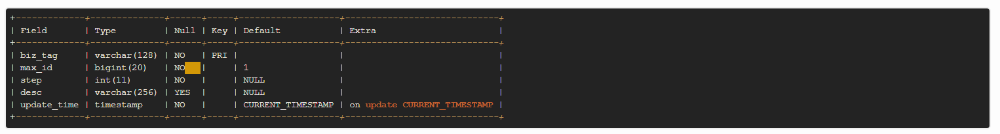

### 号段模式
　　低位趋势增长，高可用，采用从数据库获取发号的起始 ID 值、最大 ID 值，发号是在本机进行，即使数据库宕机，也能保证一段时间内正常发号，ID 可计算，不适用于订单 ID 生成场景。<br />
　　注意，数据库只保存起始 ID 值、最大 ID 值，发号 ID 是在本机机器进行的，多线程下发号 ID 会使用读锁保证可见性，判断发号 ID 值是否小于数据库中配置的最大 ID 值，是则继续发号，不是则切换到另外一个 buffer 继续发号。<br />
　　如下图，为 Leaf 数据库中的号段表格式如下：



### SegmentService
　　主要是解析配置文件，创建数据库连接池以及创建 ID 生成器 [SegmentIDGenImpl](https://github.com/martin-1992/Leaf/blob/master/notes/%E5%8F%B7%E6%AE%B5%E6%A8%A1%E5%BC%8F/SegmentIDGenImpl%23init.md)。

- 载入配置文件 leaf.properties；
- 解析配置文件，判断是否开启号段模式，不开启则 ID 返回为 0；
- 创建 Druid 数据库连接池，根据配置文件配置；
- 初始化 sqlSessionFactory，用于创建 SqlSession；
- 创建 ID 生成器 SegmentIDGenImpl，并初始化；
- 初始化完毕，调用 [get](https://github.com/martin-1992/Leaf/blob/master/notes/%E5%8F%B7%E6%AE%B5%E6%A8%A1%E5%BC%8F/SegmentIDGenImpl%23get.md) 进行发号。

```java    
    public SegmentService() throws SQLException, InitException {
        // 载入配置文件 leaf.properties
        Properties properties = PropertyFactory.getProperties();
        // 是否开启号段模式，默认开启
        boolean flag = Boolean.parseBoolean(properties.getProperty(Constants.LEAF_SEGMENT_ENABLE, "true"));
        if (flag) {
            // Config dataSource
            // 创建 Druid 数据库连接池，并配置
            dataSource = new DruidDataSource();
            dataSource.setUrl(properties.getProperty(Constants.LEAF_JDBC_URL));
            dataSource.setUsername(properties.getProperty(Constants.LEAF_JDBC_USERNAME));
            dataSource.setPassword(properties.getProperty(Constants.LEAF_JDBC_PASSWORD));
            dataSource.init();

            // Config Dao
            // 初始化 sqlSessionFactory，用于创建 SqlSession
            IDAllocDao dao = new IDAllocDaoImpl(dataSource);

            // Config ID Gen
            // 创建 ID 生成器，并初始化
            idGen = new SegmentIDGenImpl();
            ((SegmentIDGenImpl) idGen).setDao(dao);
            if (idGen.init()) {
                logger.info("Segment Service Init Successfully");
            } else {
                throw new InitException("Segment Service Init Fail");
            }
        } else {
            // 不开启，则返回 ID 为 0
            idGen = new ZeroIDGen();
            logger.info("Zero ID Gen Service Init Successfully");
        }
    }
```
